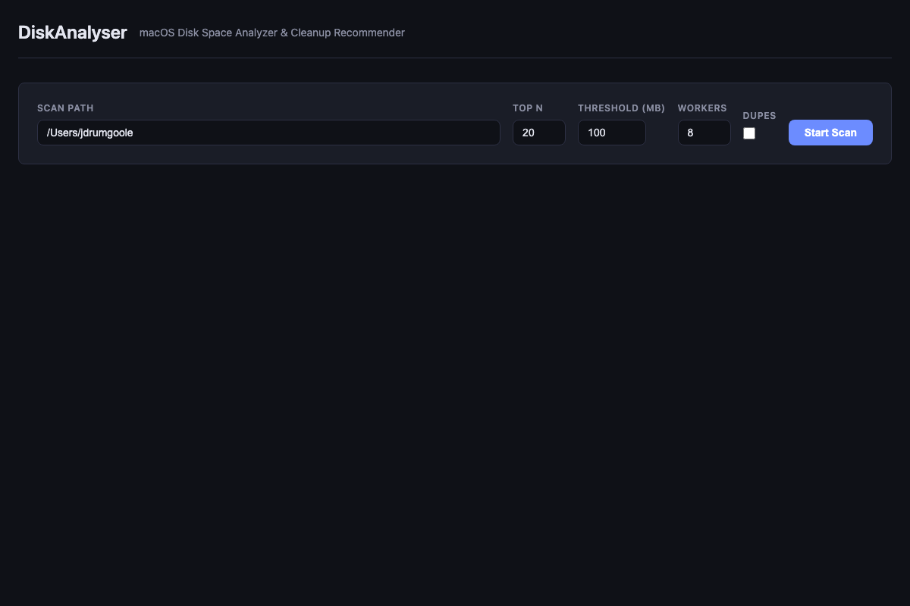

# Web Interface

StorageAnalyser includes a web-based frontend built with FastAPI.

## Quick Start

The easiest way to launch the web UI is with the `--web` flag:

```bash
storageanalyser --web
```

This starts the server on `127.0.0.1:8888`, opens your default browser, and blocks until you click the **Exit** button in the UI (which stops the server and returns control to the terminal).

## Server Management

For longer-running use, manage the server as a background process:

```bash
# Using invoke tasks
uv run python -m invoke web.start    # Start on 127.0.0.1:8888
uv run python -m invoke web.stop     # Stop the server
uv run python -m invoke web.restart  # Restart the server
uv run python -m invoke web.status   # Check if running

# Or directly
uv run storageanalyser-web
```

The server binds to `127.0.0.1:8888` (local only).

## Features

### Scan Controls
- **Scan form** - Configure path, threshold, top N, workers, duplicate detection, and ignore directories
- **Skipped directories** - Expandable list showing directories skipped by default, with checkboxes to include them in the scan
- **Start/Stop scan** - The scan button toggles to a red Stop button during scanning, allowing you to cancel cleanly and see partial results
- **Live progress** - SSE-based progress updates during scan (with cached estimates for repeat scans)

### Results Display
- **Version display** - Current version shown in the title bar
- **Disk usage pie chart** - Visual breakdown of used, reclaimable, and free space
- **Summary cards** - Files scanned, total size, reclaimable space, disk free, scan time
- **Category breakdown** - Horizontal bar chart showing space by category
- **Clickable treemap** - Visual representation of recommendations grouped by category; click any cell to jump to its entry in the recommendations table

### Recommendations
- **Category tabs** - Recommendations sorted into per-category tabs (All, Large File, Cache/Junk, Duplicate, etc.) with item counts
- **Per-tab summary** - Each category tab shows total item count and total size
- **Short paths toggle** - Switch between elided paths (`~/Documents/.../file.txt`) and full paths; hover for the full path in a tooltip
- **Sortable columns** - Click column headers to sort by path, size, age, or priority (each tab maintains independent sort state)
- **Duplicate details** - Duplicate entries list all copies with per-file size and total wasted space
- **Cleanup script** - Select recommendations and download a bash cleanup script
- **Exit button** - Cleanly shuts down the server from the browser

## Google Drive Integration

The **Google Drive** tab lets you scan your Drive storage and view a size breakdown with links to files.

### Setup

1. Go to [Google Cloud Console > Credentials](https://console.cloud.google.com/apis/credentials)
2. Create a project and enable the **Google Drive API**
3. Create an **OAuth 2.0 Client ID** (Desktop app type)
4. Download the credentials JSON file
5. In the StorageAnalyser web UI, switch to the **Google Drive** tab
6. Upload the credentials JSON and click **Authorize**
7. Complete the Google consent flow in the browser that opens
8. Click **Scan Drive** to analyze your storage

### What it shows

- **Storage pie chart** - Drive usage, trash, and free space
- **File type breakdown** - Bar chart by MIME type (Docs, Sheets, PDFs, images, etc.)
- **Largest files table** - Sorted by size with **Open** links to view each file in Google Drive

Credentials are stored locally at `~/.config/storageanalyser/`. Use the **Disconnect** button to remove saved tokens.

## Cross-Environment Deduplication

The **Cross-Environment Dedup** tab finds duplicate files across your local disk and Google Drive using MD5 checksums.

### How it works

1. Run a **Local Disk** scan and/or **Google Drive** scan -- file metadata is cached in a SQLite database at `~/.cache/storageanalyser/scans.db`
2. Switch to the **Dedup** tab and click **Compute Checksums** -- this computes full MD5 hashes for local files that are dedup candidates (files whose size matches at least one other file). Google Drive files already have MD5 checksums from Google.
3. Click **Find Duplicates** -- matches files across all sources by MD5 checksum

### What it shows

- **Duplicate groups** -- files that share the same MD5 hash, sorted by size
- **Cross-environment badge** -- groups spanning both local and Google Drive are highlighted
- **Savings estimate** -- how much space could be reclaimed by removing duplicates
- **Links** -- Google Drive files link directly to Drive; local files show full paths

## Screenshot



## API Endpoints

### Local Disk

| Method | Endpoint | Description |
|--------|----------|-------------|
| `GET` | `/` | Main page |
| `POST` | `/api/scan` | Start a scan (query params: path, top_n, threshold_mb, workers, find_duplicates, ignore_dirs, include_dirs) |
| `GET` | `/api/scan/events` | SSE progress stream |
| `GET` | `/api/scan/status` | Current scan status |
| `GET` | `/api/scan/result` | Scan results as JSON |
| `GET` | `/api/scan/script` | Download cleanup script (query param: paths) |
| `GET` | `/api/scan/skipped-dirs` | List directories skipped by default |
| `GET` | `/api/scan/ignore-dirs` | Get cached ignore dirs for a path |
| `POST` | `/api/scan/cancel` | Cancel a running scan |
| `POST` | `/api/scan/reset` | Reset state for a new scan |
| `POST` | `/api/shutdown` | Shut down the server |

### Google Drive

| Method | Endpoint | Description |
|--------|----------|-------------|
| `GET` | `/api/gdrive/status` | Check credentials and auth status |
| `POST` | `/api/gdrive/credentials` | Upload OAuth2 credentials JSON |
| `POST` | `/api/gdrive/auth` | Start OAuth2 authorization flow |
| `POST` | `/api/gdrive/scan` | Start a Google Drive scan |
| `GET` | `/api/gdrive/result` | Get scan results |
| `POST` | `/api/gdrive/disconnect` | Remove saved auth token |

### Deduplication

| Method | Endpoint | Description |
|--------|----------|-------------|
| `GET` | `/api/dedup/stats` | Stats about cached scan data |
| `POST` | `/api/dedup/checksum` | Compute MD5 checksums for local dedup candidates |
| `GET` | `/api/dedup/results` | Find duplicates across all cached scans (query param: min_size) |
